# SLAVS
## TABULA SLAVORUM — Карта Славии: племена, государства, языки, переселения, вымершие ветви

**CLASSIFICATIO: ◆ FIDELIS (историко-текстологическая база: летописи, грамоты, археология) · ◇ SUSPECTUS-FERTILIS (до-письменная история, реконструкция праславян, рабочая гипотеза) · ✠ DAMNATUS (националистические прочтения: «**наш** народ — истинный наследник» / «**другой** народ — искажённый» — **все** попытки монополизировать «истинного» славянина вне Архива) · ✚ CREDO (личная позиция владельца: славяне — **архетип** «ветви без империи», которая **сохранила** язык, миф, письменность, двоеверие и самосознание **без** **своего** государства в течение тысячелетия; это — **доказательство**, что этнос может существовать **без** политической рамки, и в этом — **сила** Славии, а **не** её слабость)**
Datum: 021.M3

> *Заявление владельца: Славия — **самая** **длинная** ветвь в Архиве. **От** Вислы **до** Дона, **от** Ладоги **до** Эгеиды, **от** VI в. **до** XXI в. **—** 1500 **лет** **истории** **народа**, **никогда** **не** **имевшего** **«**своей**»** империи **и** **никогда** **не** **исчезнувшего**. **Славяне** — **не** «**недоразвитая**» **или** «**угнетённая**» **цивилизация**; **они** — **другой** **тип** **цивилизации**, **где** **язык**, **миф**, **письмо**, **двоеверие** **заменили** **империю**. **DAMNATA** **к** **попыткам** **видеть** **Славию** **через** **«**нехватку**»** **государства** **—** **Славия** **выбрала** **другой** **путь**, **и** **это** **равноценно**. Полное исповедание — в `00/CREDO.md`.*

---

### I. СВОДКА

**Славяне** — **крупнейшая** **этническая** **группа** **Европы** **и** **Азии** **по** **числу** **языков** **и** **диалектов**, **включающая** **более** **300** **миллионов** **носителей** **в** **XXI** **в.**, **распространённая** **от** **Эльбы** **до** **Енисея** **(раньше** **и** **до** **Тихого** **океана** **через** **Колыму** **и** **Анадырь** **в** **XVII** **в.**)**, **от** **Балтики** **до** **Эгеиды** **и** **Чёрного** **моря**. **Славяне** **никогда** **не** **были** **одним** **государством**, **но** **имели** **общее** **самоназвание** **«**словене**»**, **общую** **мифологию** **(Перун**, **Велес**, **Мокошь**, **Стрибог**, **Сварог**)**; **общее** **двоеверие** **(«**Святой** **Георгий** = **Кресник** = **Перунич**»**)**; **общее** **письмо** **(глаголица** → **кириллица**)**.

**Славянские** **языки** **XXI** **в.** **(по** **количеству** **носителей**)**:
- **Русский** — **~150** **млн** **носителей**;
- **Украинский** — **~40** **млн**;
- **Польский** — **~40** **млн**;
- **Сербский**/**Хорватский**/**Боснийский**/**Черногорский** — **~20** **млн**;
- **Чешский** — **~10** **млн**;
- **Словацкий** — **~5** **млн**;
- **Болгарский** — **~9** **млн**;
- **Македонский** — **~1,4** **млн**;
- **Словенский** — **~2** **млн**;
- **Белорусский** — **~3** **млн**;
- **Украинский**/**Русский**/**Белорусский** (**русины**, **лемки**, **бойки**, **гуцулы** — **~1** **млн**);
- **Серболужицкий** (**верхний** + **нижний**) — **~20 000**–**50 000**;
- **Словенский** **диалект** **Каринтии** (**Австрия**) — **~20 000**;
- **Полабский** (**вымер** **в** **XVII–XVIII** **вв.**)**;
- **Поморский** (**вымер** **в** **XVII–XVIII** **вв.**)**;
- **Кашубский** (**Польша**) — **~100 000**–**500 000**;
- **Силезский** (**Польша**/**Чехия**) — **~50 000**;
- **Русинский** (**Закарпатье**, **Словакия**, **Польша**, **Венгрия**, **Румыния**) — **~1** **млн**;
- **Паннонский** **русинский** (**Югославия**) — **~50 000**;
- **Молизско-хорватский** (**Италия**) — **~1 000**–**5 000**;
- **Помакский** (**Балканы**) — **~150 000**–**300 000**;
- **Буневский** (**Италия**, **«**Молизо**»**) — **~1 000**–**5 000**;
- **Восточнославянские** **диалекты** **в** **Сибири** (**XVII**–**XX** **вв.**, **исчезающие**)**;
- **Кайкавский** **диалект** **хорватского** (**Хорватия**) — **~1** **млн**;
- **Чакавский** **диалект** **хорватского** (**Далмация**) — **~150 000**;
- **Торлакский** **диалект** **сербского**/**болгарского** (**Сербия**/**Болгария**/**Македония**/**Косово**) — **~3** **млн**;
- **Ужгородский**, **Хустский**, **Раховский** **диалекты** **русинского** (**Закарпатье**)**;
- **Сибирские** **старожилы** (**сибиряки**) — **~5** **млн** **исторически**, **в** **настоящее** **время** **слились** **с** **русским**;
- **Поволжские**, **Донские**, **Кубанские**, **Ставропольские**, **Терские** **казаки** — **~3** **млн**;
- **Американские** **славяне** (**США**/**Канада**/**Аргентина**/**Бразилия**/**Австралия**) — **~10** **млн** **(с** **смешанными** **идентичностями**)**;
- **Западноевропейские** **славяне** (**Германия**/**Франция**/**Великобритания**/**Испания**/**Италия**) — **~5** **млн**.

**Славянские** **государства** **XXI** **в.** **(12)**:
- **Россия**, **Украина**, **Беларусь**, **Польша**, **Чехия**, **Словакия**, **Словения**, **Хорватия**, **Босния** **и** **Герцеговина**, **Сербия**, **Черногория**, **Македония** **(Северная)**;
- **Болгария** **(включена** **в** **Южный** **славянский** **кластер**)**;
- **А** **также**: **Польша** **(«**Междуморье**»** **—** **Польша**, **Литва**, **Беларусь**, **Украина** **как** **«**пограничные**»** **земли**)**.

[Sedov 2002; **Славянские** **древности** 1995–2014; **Fine** 1983/1987; **Curta** 2001/2006; **Ловмянский** 2003; **Vernadsky** 1943/1996; **см. также** `slavjane.md`]

### II. TABULA SLAVORUM — Mermaid-диаграмма

```mermaid
graph TB
  %% КОРЕНЬ
  KO["Единый культурный ствол<br/>(общеиндоевропейский,<br/>до Славии)"]

  %% ВЕТВЬ: СЛАВИЯ
  SLAV["СЛАВИЯ<br/>REPLICATIO<br/>VI–XII вв."]

  %% БАЛКАНСКИЙ БУКЕТ
  SLO["СЛОВЕНИЯ<br/>RETENTIO<br/>(Карантания, Княжий Камень)"]
  HRV["ХОРВАТИЯ<br/>REDITUS<br/>(Дубровник, глаголица)"]
  BOS["БОСНИЯ<br/>CONCURRENTIA<br/>(богомилы, 1463–)"]
  SER["СЕРБИЯ<br/>RESISTENTIA<br/>(Косово 1389, Рашка)"]
  MNG["ЧЕРНОГОРИЯ<br/>ISOLATIO<br/>(Зета, Ловчен)"]
  MAK["МАКЕДОНИЯ<br/>NODUS<br/>(Самуил, Александр Македонский)"]
  BUL["БОЛГАРИЯ<br/>CONCURRENTIA<br/>(Симеон, тюрко-славяне)"]

  %% ВОСТОЧНЫЙ БУКЕТ
  RUS["РУСЬ<br/>REPLICATIO<br/>(Киев, Москва)"]
  BEL["БЕЛАРУСЬ<br/>REPLICATIO<br/>(Полоцк, Туров)"]
  UKR["УКРАИНА<br/>REPLICATIO<br/>(Киев, Галич)"]

  %% ЗАПАДНЫЙ БУКЕТ
  POL["ПОЛЬША<br/>EDITIO<br/>(Мешко I, Краков)"]
  CZE["ЧЕХИЯ<br/>EDITIO<br/>(Борживой I, Прага)"]
  SVK["СЛОВАКИЯ<br/>EDITIO<br/>(Великая Моравия)"]
  SRL["СЕРБО-ЛУЖИЦКИЕ<br/>RETENTIO<br/>(Сорбы, Венды)"]
  PBL["ПОЛАБСКИЕ<br/>ВЫМЕРЛИ<br/>(Вендский крестовый 1147)"]
  PMR["ПОМОРСКИЕ<br/>ВЫМЕРЛИ<br/>(Поморский крестовый 1109)"]
  KSH["КАШУБЫ<br/>RETENTIO<br/>(Гданьск, Поморье)"]
  RUSYN["РУСИНЫ<br/>RETENTIO<br/>(Закарпатье)"]
  CARP["КАРПАТСКИЕ СЛАВЯНЕ<br/>RETENTIO<br/>(Карпатская дуга 1500 км)"]

  %% ВЫМЕРШИЕ
  W1["ВЕЛИКО-МОРАВСКАЯ<br/>ВЫМЕРЛА<br/>(906, Кирилло-Мефодиевская)"]
  W2["ПОЛАБСКАЯ<br/>ВЫМЕРЛА<br/>(Вендский крестовый 1147)"]
  W3["ПОМОРСКАЯ<br/>ВЫМЕРЛА<br/>(1109)"]
  W4["БОСНИЙСКАЯ ЦЕРКОВЬ<br/>ВЫМЕРЛА<br/>(1463)"]
  W5["БОГОМИЛЫ<br/>ВЫМЕРЛИ<br/>(X-XV вв.)"]
  W6["КАТАРЫ<br/>ВЫМЕРЛИ<br/>(альбигойский 1209-1229)"]

  %% КОНТАКТЫ
  KO --> SLAV
  SLAV --> SLO
  SLAV --> HRV
  SLAV --> BOS
  SLAV --> SER
  SLAV --> MNG
  SLAV --> MAK
  SLAV --> BUL
  SLAV --> RUS
  SLAV --> BEL
  SLAV --> UKR
  SLAV --> POL
  SLAV --> CZE
  SLAV --> SVK
  SLAV --> SRL
  SLAV --> PBL
  SLAV --> PMR
  SLAV --> KSH
  SLAV --> RUSYN
  SLAV --> CARP

  %% ВЫМЕРШИЕ ОТ КОРНЯ
  SLAV -.->|"вымерли"| W1
  SLAV -.->|"вымерли"| W2
  SLAV -.->|"вымерли"| W3
  SLAV -.->|"вымерли"| W4
  SLAV -.->|"вымерли"| W5
  SLAV -.->|"вымерли"| W6

  %% КОНТАКТЫ ВНЕШНИЕ
  SLAV ===|"визант.<br/>контакт"| BUL
  SLAV ===|"аварский<br/>контакт"| SLO
  SLAV ===|"хазарский<br/>контакт"| RUS
  SLAV ===|"герм.<br/>контакт"| POL
  SLAV ===|"монг.<br/>контакт"| RUS
  SLAV ===|"финно-уг.<br/>контакт"| RUS
  SLAV ===|"тюрк.<br/>контакт"| BUL
  SLAV ===|"древне-русск.<br/>контакт"| UKR
  SLAV ===|"хазар.<br/>контакт"| BEL
  SLAV ===|"лат.<br/>контакт"| HRV
  SLAV ===|"балт.<br/>контакт"| POL
  SLAV ===|"балкан.<br/>контакт"| SER
  SLAV ===|"роман.<br/>контакт"| BOS
  SLAV ===|"тюрк.<br/>контакт"| MAK
  SLAV ===|"тур.<br/>контакт"| BOS
  SLAV ===|"католич.<br/>контакт"| CZE
  SLAV ===|"католич.<br/>контакт"| HRV
  SLAV ===|"правосл.<br/>контакт"| SER
  SLAV ===|"ислам.<br/>контакт"| BOS
  SLAV ===|"протоболг.<br/>контакт"| BUL
  SLAV ===|"дакийск.<br/>контакт"| CARP
  SLAV ===|"румынск.<br/>контакт"| CARP
  SLAV ===|"венг.<br/>контакт"| CARP
  SLAV ===|"шумеро-акад.<br/>исток"| KO
```

**Условные обозначения**:
- **Сплошная линия** = активная ветвь (жива в XXI в.)
- **Пунктирная линия** = вымершая ветвь (существовала, но исчезла)
- **Жирная линия** = контакт (влияние, обмен, заимствование)
- **Типы стратегий ветвей**:
  - **REPLICATIO** (Репликация) — основная стратегия Славии, языковая репликация в новых условиях
  - **RETENTIO** (Удержание) — удержание старой идентичности (словенцы, лужичане, кашубы, русины)
  - **REDITUS** (Возвращение) — возврат к старой форме (хорватский, сербский, венгерский)
  - **CONCURRENTIA** (Соперничество) — конкуренция внутри Славии (Босния, Болгария)
  - **ISOLATIO** (Изоляция) — изоляция от других (Черногория)
  - **NODUS** (Узел) — узел, перекрёсток (Македония)
  - **RESISTENTIA** (Сопротивление) — сопротивление внешнему давлению (Сербия)
  - **EDITIO** (Издание) — формирование нового стандарта (Польша, Чехия, Словакия)

### III. ЗАПАДНЫЙ БУКЕТ — ПОЛЬША, ЧЕХИЯ, СЛОВАКИЯ, ЛУЖИЦА, ПОЛАБЬЕ

**Польша** **(**Polska**)**:
- **Польские** **племена** **(V–IX** **вв.**) — **поляне** (**Polanie**, **«**поляне**»** **=** **«**жители** **полей**»**), **мазоване** (**Mazowszans**), **слензане** (**Ślężanie**), **висляне** (**Wiślanie**), **ленчане** (**Lędzianie**), **поморяне** (**Pomorzanie**)**;
- **Польское** **государство** — **Пясты** **(**Piastowie**)** — **Мешко** **I** **(**Mieszko** **I**, **~960–992**)** — **крещение** **Д** **(**966**)**;
- **Болеслав** **I** **Храбрый** **(**Bolesław** **I** **Chrobry**, **992–1025**)** — **король** **Польши** **(1025)**;
- **Казимир** **I** **Восстановитель** **(**Kazimierz** **I**, **1039–1058**)**;
- **Болеслав** **III** **Кривоустый** **(**Bolesław** **III**, **1102–1138**)** — **«**тестамент**»** **Болеслава** **(1105)**, **деление** **Польши**;
- **XIII** **в.** — **распад** **на** **герцогства** **(около** **30** **княжеств**)**;
- **Казимир** **III** **Великий** **(**Kazimierz** **III**, **1333–1370**)** — **объединитель**;
- **Ягеллоны** **(**Jagiellonowie**, **1386–1572**)** — **династия** **Литвы** + **Польши**;
- **Речь** **Посполитая** **(**Rzeczpospolita**, **1569–1795**)** — **федерация** **Польши** + **Литвы**;
- **Разделы** **Польши** **(1772, 1793, 1795)** — **Пруссия**, **Россия**, **Австрия**;
- **Польша** **XXI** **в.** — **Республика** **Польша** **(с** **1989**)**;
- **«**Кресы**»** **(Kresy)** — **«**восточные** **окраины**»** **(Литва**, **Беларусь**, **Украина**)**;
- **Поляки** — **~40** **млн**;
- **Язык** — **польский** **(лехитская** **подгруппа** **западнославянских**)**.

**Чехия** **(**Čechy**)**:
- **Чешские** **племена** **(VI–IX** **вв.**) — **чехи** (**Čechové**), **мораване** (**Moravané**);
- **Великая** **Моравия** **(**Velká** **Morava**, **833–906**)** — **первое** **государство**;
- **Моймир** **I**, **Ростислав**, **Святополк**, **Святоплук** **—** **«**золотой** **век**»**;
- **Кирилло-** **Мефодиевская** **миссия** **(863)**;
- **Падение** **Великой** **Моравии** **(906)** — **венгры**;
- **Пржемысловцы** **(**Přemyslovci**, **IX–XIII** **вв.**)** — **чешские** **князья**;
- **Борживой** **I** **(870–889)** — **крещение**;
- **Святой** **Вацлав** **(**Svatý** **Václav**, **«**Вацлав**», **~907**)** — **патрон** **Чехии**;
- **Болеслав** **I**, **II**, **III** **(**Boleslav**)**;
- **Пржемысл** **Отакар** **II** **(**Přemysl** **Otakar** **II**, **1253–1278**)** — **«**король** **железа** **и** **золота**»**;
- **Пржемысловцы** **вымерли** **(1306)**;
- **Люксембурги** **(1310–1437)**;
- **Ян** **Гус** **(**Jan** **Hus**, **~1370–1415**)** — **«**гуситы**»**, **Констанцский** **собор**;
- **Гуситские** **войны** **(1419–1434)**;
- **Габсбурги** **(**Habsburgové**, **1526–1918**)**;
- **Чехословакия** **(1918–1992)**;
- **Чешская** **Республика** **(с** **1993**)**;
- **Чехи** — **~10** **млн**;
- **Язык** — **чешский** **(западнославянский**)**.

**Словакия** **(**Slovensko**)**:
- **Словацкие** **племена** **(V–IX** **вв.**) — **словаки** **(**Slováci**)**;
- **Великая** **Моравия** **(833–906)**;
- **Венгерское** **королевство** **(XI**–**XIX** **вв.**) — **в** **составе** **Венгрии** **~1000** **лет**;
- **Словацкое** **национальное** **возрождение** **(**Štúr**, **Bernolák**, **Hodža**)** **(XIX** **в.**) — **кодификация** **словацкого** **языка**;
- **Чехословакия** **(1918–1992)**;
- **Словацкая** **Республика** **(с** **1993**)**;
- **Словаки** — **~5** **млн**;
- **Язык** — **словацкий** **(западнославянский**)**.

**Сербо-лужицкие** **(**Serbja** **/** **Sorben**)**:
- **Лужичане** **(**Luzičane**)**;
- **В** **составе** **Германии** **(после** **X** **в.**)**;
- **Сорбы** **(**Sorbowie**)** — **верхние** **и** **нижние**;
- **Лужицкая** **письменность** **(XVI** **в.**, **Микалаш** **Якоб**)**;
- **Лужицкий** **язык** **(два** **стандарта** — **верхний** + **нижний**)**;
- **Лужичане** **в** **ГДР** **(**DDR**)** — **«**социалистические** **славяне**»**;
- **Лужичане** **XXI** **в.** — **~20 000**–**50 000** **активных** **носителей**;
- **Славянский** **остров** **в** **немецком** **море**;
- **Язык** — **серболужицкий** **(западнославянский**)**;
- **«**Сорбы**»** **=** **«**сербы**»** **(этноним**, **идентичный** **сербам** **южным**)**;
- **См.** `slavjane.md`.

**Полабские** **(**Polabian**)** — **ВЫМЕРЛИ**:
- **Племена** — **древане** **(**Drevane**), **гломачи** **(**Glomaci**), **лютичи** **(**Liutici**), **бодричи** **(**Obodrites**), **полабы** **(**Polabi**), **венды** **(**Wenden**)**;
- **Вендский** **крестовый** **поход** **(1147)** — **поражение** **славян**;
- **Германизация** **и** **ассимиляция** **(XII–XVII** **вв.**)**;
- **Полабский** **язык** **вымер** **в** **XVII–XVIII** **вв.**;
- **Последние** **носители** — **в** **Нижней** **Саксонии** **и** **Гольштейне** **до** **XVIII** **в.**;
- **Славянские** **топонимы** **в** **Германии** — **«**Лейпциг**»** **(**Lipsk** = **липа**), **«**Бранденбург**»** **(**Branibor** = **«**защитник**»**), **«**Берлин**»** **(**Berlin** = **«**медведь**»**)**;
- **См.** `slavjane.md` **(вымершая** **линия**)**.

**Поморские** **(**Pomeranian**)** — **ВЫМЕРЛИ**:
- **Поморяне** **(**Pomorzanie**);
- **Поморский** **крестовый** **поход** **(1109)** — **польский** **Болеслав** **III**;
- **Германизация** **(XII–XVII** **вв.**)**;
- **Кашубский** — **«**выжил**»** — **~100 000**–**500 000** **в** **Польше** **(Гданьск**/**Гдыня**/**Вейхерово**)**;
- **См.** `slavjane.md` **(вымершая** **линия**)**.

**Кашубы** **(**Kaszubi**)**:
- **Под** **группой** **поморской**;
- **Кашубский** **язык** **(с** **XIV** **в.**) — **«**свой**»** **или** **«**диалект** **польского**»**;
- **Движение** **за** **кашубскую** **автономию** **(XIX**–**XX** **вв.**)**;
- **Сейм** **Кашубов** **(Zrzeszenie** **Kaszubsko-Pomorskie**)**;
- **Кашубы** — **~100 000**–**500 000**;
- **См.** `slavjane.md`.

**Русины** **(**Rusyny**)**:
- **Восточнославянский** **язык** **(карпато-** **русинский**)**;
- **Закарпатье** **(Украина**/**Словакия**/**Польша**/**Венгрия**/**Румыния**/**Югославия**)**;
- **Русины** **в** **США** **и** **Канаде** **(переселенцы** **с** **XIX** **в.**)**;
- **«**Русинский**»** **вопрос** **(украинский** **vs** **«**отдельный**»** **язык**)** — **дискуссия**;
- **Русины** — **~1** **млн**;
- **Язык** — **русинский** **(восточнославянский**)**;
- **См.** `slavs/carpitoslavi.md` **(«**горная** **линия**» **Славии, тиверцы** **+** **уличи** **+** **Галицкие** **хорваты** **+** **лемки**/**бойки**/**гуцулы**/**русины** — 2000 лет карпатской идентичности)**.

**Карпатские** **славяне** **(«**горная** **линия**» **Славии**, **Carpitoslavi**)**:
- **Многослойная** **группа** **(дакийский** **субстрат** **+** **славянский** **слой** **+** **тюркский** **контакт** **+** **германский** **контакт** **+** **румынский** **субстрат** **+** **венгерский** **контакт**)**;
- **Карпатская** **дуга** **1500** **км** **(от** **Татр** **до** **Чёрногора**/**Говерла** **2061** **м**)**;
- **Подгруппы**: **лемки** **(Lemkos)**, **бойки** **(Boikos)**, **гуцулы** **(Hutsuls)**, **русины** **(Rusyny)**, **закарпатцы** **(Zakarpattia)**, **марамурош** **(Maramureș)**, **буковинцы** **(Bucovina)**;
- **Древние** **племена** **(**ПВЛ**)**: **тиверцы** **(«**между** **Днестром** **и** **Дунаем**»**), **уличи** **(«**между** **Днестром** **и** **Дунаем**»**), **Галицкие** **хорваты** **(«**Червоная** **Русь**»**)**;
- **Дакийские** **предки**: **карпы** **(Κάρποι**, **Carpidava**, **Strabo**/**Pliny**/**Ptolemy**/**Appianus**/**Herodotus**/**Zosimus**/**Iordanes**) — **«**римляне** **депортировали** **100 000** **карпов** **в** **Кампанию** **в** **201** **г.** **н.э.**»**;
- **Диалекты**: **галицкий**, **лемковский**, **бойковский**, **гуцульский**, **русинский** **(ЮНЕСКО** **2011)**;
- **Обряды**: **купала**, **коляда**, **маланка**, **русалии**, **малый** **карнавал**;
- **Двоеверие**: **христианизированный** **«**Святой** **Георгий**»** **=** **«**Кресник**»**;
- **Итого** **«**карпатских** **славян**»** **в** **XXI** **в.** **—** **~10–12** **млн** **(украинцы** **5–6**, **поляки** **3–4**, **словаки** **0,5**, **румыны** **3–4**, **русины** **0,1–0,2**, **венгры** **0,001**)**;
- **См.** `slavs/carpitoslavi.md` **(полное** **досье** — 820 строк, 10 разделов, ИСТОЧНИКИ)**.

**См. также** `slavjane.md`, `slavs/moravia-magna.md`, `slavs/bulgaria-prima.md`, `slavs/slavica-xix.md`, `brizinski-spomenici.md`, `slavs/methodius-abc.md`, `slavs/carpitoslavi.md` **(новая** **«**горная**»** **ветвь** **Славии** — тиверцы, уличи, лемки, бойки, гуцулы, русины)**.

### IV. ВОСТОЧНЫЙ БУКЕТ — РУСЬ, УКРАИНА, БЕЛАРУСЬ

**Русь** **(**Русь**)**:
- **Восточнославянские** **племена** **(V–IX** **вв.**) — **поляне** **(«**поле**»**, **«**жители** **полей**»**), **северяне** **(**Severane**), **древляне** **(**Drevljane** = «**лесные** **жители**»**), **дреговичи** **(**Dregoviči**), **полочане** **(**Poločane**), **словене** **(**Slovene** **ильменские**), **вятичи** **(**Vjatiči**), **радимичи** **(**Radimiči**), **кривичи** **(**Kriviči**)**;
- **«**Повесть** **временных** **лет**»** **(ПВЛ, ~1113)** — **«**откуда** **есть** **пошла** **Русская** **земля**»**;
- **«**Варяжская** **легенда**»** — **«**Русь** **из** **Норманами**»** **(кон** **VIII** **в.**, **Рюрик**, **Олег**, **Игорь**)**;
- **«**Вещий** **Олег**»** **(879–912)** — **объединил** **Новгород** **и** **Киев** **(882)**, **«**щит** **на** **вратах** **Царьграда**»**;
- **Князь** **Игорь** **(912–945)**;
- **Княгиня** **Ольга** **(945–962)** — **крещение** **~955**;
- **Князь** **Святослав** **I** **(962–972)** — **«**Святослав** **Игоревич**»** **(тот** **самый**, **что** **у** **Пушкина** **в** **«**Вещем** **Олеге**»**)**;
- **Владимир** **I** **Креститель** **(980–1015)** — **крещение** **988**;
- **Ярослав** **Мудрый** **(1019–1054)** — **«**Русская** **Правда**»**;
- **Владимир** **Мономах** **(1113–1125)** — **«**Поучение** **детям**»**;
- **Монгольское** **нашествие** **(1237–1240)**;
- **Московское** **царство** **(XIV**–**XVI** **вв.**) — **Иван** **III**, **Иван** **IV** **Грозный**;
- **Российская** **империя** **(1721–1917)** — **Пётр** **I**, **Екатерина** **II**;
- **РСФСР** **(1917–1991)** — **советская** **Россия**;
- **Российская** **Федерация** **(с** **1991**)**;
- **Русские** — **~130** **млн** **(Россия** **+** **диаспора**)**;
- **Язык** — **русский** **(восточнославянский**)**.

**Украина** **(**Україна**)**:
- **Восточнославянские** **племена** — **поляне** **(«**поле**»** = **«**Киевщина**»**), **северяне** **(«**Северщина**»**), **древляне** **(«**Волынь**»**), **тиверцы** **(«**Буковина**»**), **хорваты** **(«**Галичина**»**, **«**Червонная** **Русь**»**)**;
- **Киевская** **Русь** **(X–XII** **вв.**) — **общая** **с** **«**Русью**»**;
- **Галицко-** **Волынское** **княжество** **(XII–XIV** **вв.**) — **«**украинская**»** **линия**;
- **Литовско-** **Русское** **государство** **(XIV–XVI** **вв.**) — **«**Великое** **княжество** **Литовское**»**;
- **Казачество** **(XV**–**XVIII** **вв.**) — **Запорожская** **Сечь** **(1552–1775)**;
- **Хмельницкое** **восстание** **(1648–1657)**;
- **Руина** **(1657–1687)**;
- **Украинская** **Народная** **Республика** **(1917–1920)**;
- **Украинская** **ССР** **(1922–1991)**;
- **Независимая** **Украина** **(с** **1991)**;
- **«**Оранжевая** **революция**»** **(2004)**, **«**Евромайдан**»** **(2014)**;
- **Анексия** **Крыма** **(2014)**, **война** **на** **Донбассе** **(2014–2022)**;
- **Полномасштабное** **вторжение** **России** **(2022**–**)**;
- **Украинцы** — **~40** **млн**;
- **Язык** — **украинский** **(восточнославянский**)**.

**Беларусь** **(**Беларусь**)**:
- **Восточнославянские** **племена** — **дреговичи** **(«**Дрегва**»**), **кривичи** **(«**Полоцк**»**), **радимичи** **(«**Сож**»**);
- **Полоцкое** **княжество** **(XI–XIII** **вв.**) — **«**независимая**» **Беларусь**;
- **Туровское** **княжество** **(XI–XII** **вв.**);
- **Великое** **княжество** **Литовское** **(XIV–XVI** **вв.**) — **«**Белая** **Русь**»**;
- **Речь** **Посполитая** **(1569–1795)** — **Польша** + **Литва**;
- **Российская** **империя** **(1795–1917)**;
- **БНР** **(1918)** — **Белорусская** **Народная** **Республика**;
- **БССР** **(1919–1991)** — **советская** **Беларусь**;
- **Независимая** **Беларусь** **(с** **1991**)**;
- **Белорусы** — **~10** **млн**;
- **Язык** — **белорусский** **(восточнославянский**)**.

**См. также** `slavjane.md`, `slavs/slavica-xix.md`, `carantania-paganitas.md`, `scythae-donum.md`, `slavs/bulgaria-prima.md`, `austro-yahve.md`.

### V. ЮЖНЫЙ БУКЕТ — СЛОВЕНИЯ, ХОРВАТИЯ, БОСНИЯ, СЕРБИЯ, ЧЕРНОГОРИЯ, МАКЕДОНИЯ

**Словения** — **см.** `slavs/carantania.md` **(Carantanian arc, 11 досье)**;
**Хорватия** — **см.** `slavs/croatia-glagolitica.md` + `slavs/croatia-regnum.md` + `slavs/croatia-modern.md` + `slavs/croatia-antiqua.md` + `slavs/croatia-religiosa.md` + `slavs/bosnia-regnum.md`;
**Босния** — **см.** `bosnia-paganitas.md` **(Bosnian arc, 8 досье)**;
**Сербия** — **см.** `slavs/serbia-rashka.md` **(базовое** **досье**)**;
**Черногория** — **отдельного** **досье** **нет** **(дыра** **в** **Архиве**)**;
**Македония** — **отдельного** **досье** **нет** **(дыра** **в** **Архиве**)**;
**Болгария** — **см.** `slavs/bulgaria-prima.md` **(Bulgarian arc, 2 досье)**.

**См. также** `slavjane.md`, `bulgaria-paganitas.md`, `valachia-paganitas.md`, `bosnia-paganitas.md`, `carantania-paganitas.md`.

### VI. ПАННОНСКИЕ СЛАВЯНЕ — СЛОВЕНЦЫ В АВСТРИИ, ВЕНГРИИ

**Паннонские** **славяне** **(Prekmurje**, **Porabje**)**:
- **Словенцы** **в** **Австрии** **(Каринтия**, **Штирия**)**;
- **Словенцы** **в** **Венгрии** **(венгерско-** **словенский** **языковой** **остров**);
- **«**Порубье**»** **(Porabje)** — **венгерские** **словенцы** **в** **районе** **Шопрон**/**Sopron**;
- **«**Прекмурье**»** **(Prekmurje)** — **словенцы** **в** **Венгрии** **вдоль** **реки** **Мура**;
- **«**Цанталь**»** **(Zentag)** — **словенцы** **в** **Румынии** **(Сибиу**, **Брашов**);
- **Словенское** **национальное** **меньшинство** — **~20 000**–**50 000**;
- **«**Цантальские** **словенцы**»** **=** **«**румынские** **словенцы**»** — **диалект** **словенского**;
- **См.** `slavs/carantania.md`, `austria-occulta.md`, `hungaria-occulta.md`.

### VII. МОЛИТВЕННАЯ СЛАВЯНСКАЯ МАТРИЦА

**Славянская** **письменность**:
- **Глаголица** — **создана** **Кириллом** **и** **Мефодием** **(~862–863)**;
- **Кириллица** — **создана** **учениками** **Мефодия** **в** **Преславе** **(~893)**;
- **«**Черноризец** **Храбр**»** **(X** **в.**)** — **«**О** **письменах**»** **—** **первый** **филологический** **трактат**;
- **Глаголические** **памятники** — **«**Киевские** **листки**»**, **«**Македонский** **глаголический** **листок**»**, **«**Синайский** **псалтырь**»**, **«**Ассеманиево** **евангелие**»**, **«**Зографское** **евангелие**»**, **«**Клоц**»**, **«**Мариинское** **евангелие**»**;
- **Кириллические** **памятники** — **«**Саввина** **книга**»**, **«**Синайский** **псалтырь**»**, **«**Слепченский** **апостол**»**, **«**Боянские** **палимпсесты**»**, **«**Добрейшево** **четвероевангелие**»**;
- **«**Брижинские** **памятники**»** **(**~1000**, **Карантания**)** — **уникальный** **гибрид** **(латиница** **+** **старокарантанский**)**;
- **«**Русские** **памятники**»** — **«**Остромирово** **евангелие**»** **(1056–1057)**, **«**Мстиславово** **евангелие**»** **(~1103–1117)**, **«**Архангельское** **евангелие**»** **(1092)**, **«**Галицкое** **евангелие**»** **(1144)**, **«**Муромская** **псалтырь**»**;
- **«**Сербские** **памятники**»** — **«**Мирославлево** **евангелие**»** **(1180)**, **«**Вуканово** **евангелие**»**;
- **«**Болгарские** **памятники**»** — **«**Супрасальская** **летопись**»** **(X** **в.**)**, **«**Энинский** **апостол**»**, **«**Драгомирово** **евангелие**»**;
- **Славянская** **письменность** — **древнейшая** **кириллица** **из** **Преслава** **(Болгария** **~893)** **→** **древнерусский** **(«**Остромирово** **евангелие**»** **~1056–1057**)** **→** **церковнославянский** **(**XIV**–**XVII** **вв.**, **Москва**)** **→** **гражданский** **шрифт** **(**Пётр** **I, 1708**)** **→** **современный** **русский** **язык**;
- **См.** `slavs/methodius-abc.md`, `brizinski-spomenici.md`, `slavjane.md`.

### VIII. ЯЗЫКОВАЯ КАРТА СЛАВЯН

**Славянские** **языки** **(по** **классификации** **Миклошича**/**Шафарика**)**:

**I. ЮЖНОСЛАВЯНСКАЯ** **группа** **(с** **6** **стандартами**)**:
- **1. Словенский** **(**slovensko**)**;
- **2. Сербский**/**Хорватский**/**Боснийский**/**Черногорский** **(**srpsko**/**hrvatsko**/**bosansko**/**crnogorski**, **4** **стандарта**)**;
- **3. Болгарский** **(**български**)**;
- **4. Македонский** **(**македонски**)**;
- **5. Староцерковнославянский** **(**мёртв**, **IX–XI** **вв.**)**;
- **6. Словенско-** **кайкавский** **(**хорватский** **диалект**)**;

**II. ЗАПАДНОСЛАВЯНСКАЯ** **группа** **(с** **6** **стандартами**)**:
- **1. Польский** **(**polski**)**;
- **2. Чешский** **(**český**)**;
- **3. Словацкий** **(**slovenský**)**;
- **4. Серболужицкий** **(**serbsce**, **2** **стандарта**)**;
- **5. Кашубский** **(**kaszëbsczi**)**;
- **6. Силезский** **(**ślůnski**)**;
- **7. Полабский** **(**ВЫМЕРШИЙ**)**;
- **8. Поморский** **(**ВЫМЕРШИЙ**)**;

**III. ВОСТОЧНОСЛАВЯНСКАЯ** **группа** **(с** **4** **стандартами**)**:
- **1. Русский** **(**русский**)**;
- **2. Украинский** **(**українська**)**;
- **3. Белорусский** **(**беларуская**)**;
- **4. Русинский** **(**русиньскый**)**.

**Общая** **численность** **носителей** **XXI** **в.**:
- **Восточнославянские** — **~190** **млн**;
- **Западнославянские** — **~55** **млн**;
- **Южнославянские** — **~30** **млн**;
- **ВСЕГО** **~275–285** **млн**;
- **С** **диаспорой** — **~300+** **млн**;
- **С** **«**языковой** **сетью**»** **(говорящие** **на** **2** **языке**)** — **~400+** **млн**.

**Индоевропейские** **параллели**:
- **Славянские** **→** **балтские** **(**литовский**, **латышский**, **прусский** — **ВЫМЕРШИЙ**)** — **наиболее** **близкая** **группа** **(балто-** **славянская** **общность** **~3000** **до** **н.э.**)**;
- **Славянские** **→** **германские** **(**немецкий**, **английский**, **шведский**, **исландский**, **готский** **—** **ВЫМЕРШИЙ**)** — **второе** **место**;
- **Славянские** **→** **иранские** **(**авест.**, **согд.**, **осет.**, **тадж.**, **пушту**)**;
- **Славянские** **→** **индоарийские** **(**санскр.**, **хинди**)**;
- **Славянские** **→** **греческие** **(**греч.**)**;
- **Славянские** **→** **албанские** **(**алб.**)**;
- **Славянские** **→** **армянские** **(**арм.**)**;
- **Славянские** **→** **тюркские** **(**тюрк.**, **тюрк.** **заимствования** **в** **славянские** **~300** **слов**)**;
- **Славянские** **→** **финно-** **угорские** **(**фин.**, **эст.**, **венг.**, **морд.**, **удм.**, **мари**)**;
- **Славянские** **→** **монгольские** **(**монг.**, **калмыц.**)**;
- **Славянские** **→** **монг.** **через** **тюрк.**

[Sedov 2002; **Славянские** **древности** 1995–2014; **Ловмянский** 2003; **Bezlaj** 1976–2005; **Lencek** 1982; **см. также** `slavjane.md`]

### IX. РЕЛИГИОЗНАЯ КАРТА СЛАВЯН

**Язычество**:
- **В** **VI** **в.** — **все** **славяне** **язычники**;
- **До** **X** **в.** — **массовое** **язычество**;
- **«**Святой** **Георгий**»** **=** **главный** **христианизированный** **языческий** **бог** **(Кресник**, **Перунич**, **Егорий**)**;
- **«**Иван** **Купала**»** **=** **дождевая** **дева**;
- **«**Параскева** **Пятница**»** **=** **Мокошь**;
- **«**Илья** **Пророк**»** **=** **громовержец** **(Перун**/**Перунич**/**Кресник**/**Гром**/**Сварог**)**;
- **«**Святой** **Власий**»** **=** **скотий** **бог** **(Велес**/**Волос**)**;
- **«**Святой** **Николай**»** **=** **бог** **дороги**;
- **«**Святой** **Кузьма-** **Демьян**»** **=** **кузнец-** **бог** **(Сварог**)**;
- **«**Рождество**»** **=** **Коляда**;
- **«**Масленица**»** **=** **«**проводы** **зимы**»**;
- **«**Благовещение**»** **=** **Жива**/**Мокошь**;
- **«**Троица**»** **=** **Купала**;
- **«**Покров**»** **=** **«**покрытие**»** **Матери** **(от** **Параскевы-** **Пятницы**)**;
- **«**Дмитриев**»** **день** **=** **«**загробные** **деды**»**;
- **«**Юрьев**»** **день** **=** **«**выгон** **скота**»** **(Велес)**.

**Христианство**:
- **Моравская** **миссия** **(863)** — **Кирилл** **и** **Мефодий**;
- **Крещение** **Болгарии** **(864)** — **Борис** **I**;
- **Крещение** **Сербии** **(~869)** — **Креститель** **Борис** **I**;
- **Крещение** **Польши** **(966)** — **Мешко** **I**;
- **Крещение** **Чехии** **(874–883)** — **Борживой** **I**;
- **Крещение** **Руси** **(988)** — **Владимир** **I**;
- **Крещение** **Хорватии** **(~800**–**925)** — **Томислав**, **Бранимир**;
- **Крещение** **Словении** **(~870)** — **Сальцбургская** **миссия**;
- **Крещение** **Сербии** **по-** **западному** **(X**–**XII** **вв.**, **католицизм**)** — **от** **Дукли** **/** **Зеты**;
- **Крещение** **Боснии** **(X**–**XII** **вв.)** — **спорное**, **богомильство**;
- **Крещение** **Македонии** **(~864–886)** — **Св.** **Климент** **Охридский**;
- **Крещение** **Черногории** **(**IX**–**X** **вв.**, **Дукля**/**Зета**)** — **св.** **Иоанн** **Владимир**.

**Ислам**:
- **Босния** **(XVI**–**XVII** **вв.)** — **«**мусульмане**»** **богомилы**;
- **Помак** **(Балканы**/**Греция**/**Турция**)** — **«**мусульмане**»** **славяне** **~150 000**–**300 000**;
- **Татары** — **мусульмане-** **тюрки** **в** **Поволжье** **(не** **славяне**)**;
- **Казахи**, **узбеки** — **мусульмане-** **тюрки** **в** **Центральной** **Азии** **(не** **славяне**)**;
- **Кашгар** — **«**сарты**»** — **мусульмане-** **тюрки** **в** **Синьцзяне** **(не** **славяне**)**.

**Иудаизм**:
- **Бессарабия** **(**Bessarabia**)** — **«**евреи**»** **в** **среде** **украинцев**/**молдаван**;
- **Галиция** — **«**евреи**»** **в** **среде** **украинцев**/**поляков**;
- **Литва** — **«**литваки**»** **(евреи** **в** **Литве** + **Беларуси** + **Польше**)**;
- **«**Славяне**»** **не** **были** **«**иудеями**»** **(кроме** **«**хазарского**»** **мифа**)**.

**См. также** `bulgaria-paganitas.md`, `carantania-paganitas.md`, `valachia-paganitas.md`, `bosnia-paganitas.md`, `dvoeverie.md`, `slavs/bulgaria-prima.md`, `slavs/bulgaria-secunda.md`, `slavs/bulgaria-renascentia.md`, `slavs/bulgaria-modern.md`, `slavs/bulgaria-ecclesia.md`, `slavs/bulgaria-cultura.md`, `slavs/bulgaria-folklore.md`, `slavs/bulgaria-lingua.md`, `slavs/croatia-regnum.md`, `slavs/croatia-modern.md`, `slavs/croatia-antiqua.md`, `slavs/croatia-religiosa.md`, `slavs/bosnia-musulmana.md`, `bessarabia.md`, `slavs/carantania.md`, `brizinski-spomenici.md`, `slavs/slavi-volochi.md`, `slavs/slavi-martyrium.md`.

### X. КУЛЬТУРНАЯ КАРТА СЛАВЯН

**Эпос**:
- **«**Игорь**»** **(**«**Слово** **о** **полку** **Игореве**»**, **XII** **в.**, **Русь**)** — **дружинный** **эпос**;
- **«**Златна** **низ**»** **(«**Золотое** **русло**»**, **сербский** **эпос**, **XIV**–**XIX** **вв.**)**;
- **«**Кральд** **Вукашин**»** **(сербско-** **македонский** **эпос**)**;
- **«**Слово** **о** **Молчалине**»** **(Лазарь** **Хребелянович** **как** **символ** **сопротивления**)**;
- **«**Песма** **о** **Сулее**»** **(Моненегринский** **эпос**)**;
- **«**Крали** **Марко**»** **(македонский** **эпос**)**;
- **«**Песни** **Гайдамаков**»** **(украинский** **эпос**, **XVIII**–**XIX** **вв.**)**;
- **«**Казацкие** **думы**»** **(украинские** **думы**, **XVI**–**XVIII** **вв.**)**;
- **«**Песни** **Яна** **Песеняка**»** **(украинский** **казацкий** **эпос**)**;
- **«**Калиновский**»** **(Беларусь**/**Польша**/**Литва**)**;
- **«**Песни** **о** **Курбском**»** **(русская**/**литовская** **граница**)**;
- **«**Красно** **знамя**»** **(украинская**/**словацкая** **баллада**)**;
- **«**Яношик**»** **(словацкий** **Robin** **Hood**)**;
- **«**Янек**»** **(чешская** **баллада**)**;
- **«**Веселы** **Пустка**»** **(польский** **романс**)**;
- **«**Кралид** **Самсон**»** **(чешский** **романс**)**;
- **«**Крали** **Елена**»** **(македонский** **романс**)**;
- **«**Сула** **и** **Смиляна**»** **(сербский** **романс**)**;
- **«**Милосав** **Обилич**»** **(сербский** **романс**)**;
- **«**Смрт** **Стефана** **Дечанского**»** **(сербский** **романс**)**;
- **«**Падение** **Царства**»** **(сербский** **романс**)**;
- **«**Крали** **Анжуйский**»** **(сербский** **романс**)**;
- **«**Дар** **Синан-** **паши**»** **(сербский** **романс**)**;
- **«**Бан** **Секула**»** **(балканский** **эпос**)**;
- **«**Мала** **Кнегиня**»** **(сербский** **романс**)**;
- **«**Юнак** **и** **девойка**»** **(общеславянский** **романс**)**;
- **«**Я** **убью** **татарина**»** **(общеславянский** **романс**)**.

**Литература**:
- **Кирилло-** **Мефодиевская** **школа** **(IX** **в.**) — **первые** **литературные** **памятники**;
- **Преславская** **школа** **(X** **в.**) — **«**Шестоднев**»**, **«**Богословие**»**, **«**Учительное** **евангелие**»**;
- **Охридская** **школа** **(X**–**XI** **вв.**) — **«**Св.** **Климент**»**, **«**Наум**»**, **«**Иоанн** **Экзарх**»**;
- **Московская** **школа** **(XV**–**XVI** **вв.**) — **«**Домострой**»**, **«**Степенная** **книга**»**, **«**Сказание** **о** **Мамаевом** **побоище**»**;
- **«**Повесть** **временных** **лет**»** **(XII** **в.**) — **«**откуда** **есть** **пошла** **Русская** **земля**»**;
- **«**Слово** **о** **полку** **Игореве**»** **(XII** **в.**) — **«**Слово**»** **о** **походе** **Игоря**;
- **«**Задонщина**»** **(XIV** **в.**) — **«**Слово**»** **о** **Куликовской** **битве**;
- **«**Хождение** **за** **три** **моря**»** **(Афанасий** **Никитин, XV** **в.**) — **русский** **путешественник**;
- **«**Домострой**»** **(XVI** **в.**) — **свод** **правил** **поведения**;
- **«**Сказание** **о** **Смутном** **времени**»** **(XVII** **в.**)**;
- **«**Слово** **о** **полку** **Игореве**»** **(повторное** **открытие** **1795** **Мусиным-** **Пушкиным**)**;
- **«**Кобзарь**»** **(Шевченко, 1840** **г.)** — **«**украинский** **Байрон**»**;
- **«**Пан** **Тадеуш**»** **(Мицкевич, 1834** **г.)** — **«**польский** **эпос**»**;
- **«**Краледворская** **рукопись**»** **(Ганка, 1817** **г.)** — **«**чешский** **эпос**»** **(подделка**)**;
- **«**Зайончек**»** **(Гусак, 1846** **г.)** — **«**словацкий** **романс**»**;
- **«**Крали** **Матьяш**»** **(Гусак)** — **словацкий** **национальный** **эпос**;
- **«**Стоглав**»** **(1551)** — **«**свод** **церковных** **правил**»**;
- **«**Житие** **Стефана** **Дечанского**»** **(XIV** **в.**, **Сербия**)**;
- **«**Крали** **Дечанский**»** **(XIV** **в.**)**;
- **«**Краткая** **Хроника** **Сербии**»** **(XV** **в.**)**;
- **«**Повест** **о** **князьях** **и** **царях**»** **(XVII** **в.**, **Сербия**)**;
- **«**Летопис** **Поп** **Дуклянина**»** **(XII** **в.**, **Дукля**/**Зета**)** — **«**Св.** **Иоанн** **Владимир**»**;
- **«**Горный** **Венец**»** **(Петр** **II** **Петрович-** **Негош, 1847)** — **«**черногорский** **Шекспир**»**;
- **«**Горный** **Венец**»** **(Петр** **II** **Негош, 1847)**;
- **«**Кольцо** **Дункана**»** **(Прешерен, 1830)**;
- **«**Крст** **при** **Савицы**»** **(Прешерен, 1836)**;
- **«**Здравница**»** **(Прешерен, 1844)**;
- **«**Ангеларус**»** **(Прешерен, 1835)**;
- **«**Мала** **Вечеря**»** **(Левстик, 1858)**;
- **«**Иво** **Андрич**»** **(нобелевский** **лауреат, 1961)** — **«**Мостарский** **мост**»**;
- **«**Меша** **Селимович**»** **(«**Дервиш** **и** **смерть**»**, **1966**)**;
- **«**Александр** **Солженицын**»** **(«**Архипелаг** **ГУЛАГ**»**)** — **«**Архипелаг** **ГУЛАГ**»** — **но** **не** **«**исключительно** **славянский**»**;
- **«**Иван** **Бунин**»** **(нобелевский** **лауреат, 1933**)**;
- **«**Борис** **Пастернак**»** **(нобелевский** **лауреат, 1958**)**;
- **«**Михаил** **Шолохов**»** **(нобелевский** **лауреат, 1965**)**;
- **«**Иосиф** **Бродский**»** **(нобелевский** **лауреат, 1987**)**;
- **«**Чеслав** **Милош**»** **(нобелевский** **лауреат, 1980**)**;
- **«**Вислава** **Шимборска**»** **(нобелевский** **лауреат, 1996**)**;
- **«**Иво** **Андрич**»** **(нобелевский** **лауреат, 1961**)**;
- **«**Олдос** **Хаксли**»** **(«**Brave** **New** **World**»**)**;
- **«**Момо** **Капор**»** **(«**Зoography**»**)**;
- **«**Слободан** **Шнайдер**»** **(«**Fountain** **of** **Sorrow**»**)**;
- **«**Дубравка** **Угрешич**» **(«**Baba** **Yaga** **Laid** **an** **Egg**»**)**;
- **«**Александр** **Хемон**» **(«**Love** **and** **Obstacles**»**)**;
- **«**Миленко** **Жерявский**» **(«**Budah** **и** **Blud**»**)**;
- **«**Владимир** **Арсениевич**» **(«**In** **the** **Time** **of** **War** »**)**;
- **«**Горан** **Петрович** **(«**Days** **of** **the** **Caterpillars** »**)**.

[Sedov 2002; **Славянские** **древности** 1995–2014; **Ловмянский** 2003; **Vernadsky** 1943/1996; **См. также** `slavs/slavica-xix.md`, `valachia-litteratura.md`, `slavs/bosnia-musulmana.md`, `slavs/carantania.md`, `slavs/bulgaria-prima.md`]

### XI. ВЕРДИКТ И МАТРИЦА

**Славия** **—** **архетип** **«**ветви** **без** **империи**»**. **1500** **лет** **истории** **(VI**–**XXI** **вв.)**, **300+** **миллионов** **носителей** **языков** **в** **XXI** **в.**, **12** **государств** **(Россия**, **Украина**, **Беларусь**, **Польша**, **Чехия**, **Словакия**, **Словения**, **Хорватия**, **Босния**, **Сербия**, **Черногория**, **Македония** + **Болгария**), **5** **полных** **arc** **в** **Архиве** **(Carantanian** + **Bosnian** + **Valachian** + **Bulgarian** **+** **общий** **Slavjane**)**.

**Главные** **следствия** **для** **Архива**:

1. **Славяне** **—** **самая** **длинная** **ветвь** **в** **Архиве**;
2. **Славяне** **никогда** **не** **имели** **«**своей**»** **империи** **(Священная** **Римская** **—** **не** **славянская**; **Османская** **—** **не** **славянская**; **Российская** **—** **частично** **славянская**)**;
3. **Славяне** **сохранили** **язык**, **миф**, **письмо**, **двоеверие** **в** **течение** **1500** **лет**;
4. **Славяне** **создали** **«**третий**»** **тип** **цивилизации** **(**не** **империя**, **не** **варварство**, **а** **«**лингвистическая** **идентичность**»**)**;
5. **Славяне** **=** **архетип** **«**жизни** **без** **государства**»**;
6. **Славяне** **—** **доказательство** **того**, **что** **этнос** **может** **существовать** **без** **политической** **рамки** **(сравним** **с** **курдами**, **басками**, **цыганами**/**рома**, **другими** **«**безгосударственными**»** **народами**)**;
7. **Славяне** **=** **доказательство** **того**, **что** **«**культура**»** **может** **быть** **устойчивее** **империи**;
8. **Славяне** **=** **доказательство** **того**, **что** **«**архетип**»** **(Перун**, **Св.** **Георгий**)** **переживает** **государства**, **империи**, **войны**;
9. **Славяне** **=** **доказательство** **того**, **что** **«**религия**»** **может** **сосуществовать** **с** **«**государством**»** **(христианство** **+** **язычество** = **двоеверие**)**;
10. **Славяне** **=** **доказательство** **того**, **что** **«**этнос**»** **=** **«**язык**»** **+** **«**миф**»** **+** **«**память**»** **(а** **не** **только** **«**государство**»**)**.

**DAMNATA** **к** **попыткам**:
- **Национализации** **«**истинного** **славянина**»**;
- **Сравнения** **«**Русь** = **«**высшая**»** **и** **«**Польша** = **«**упадшая**»** **(или** **наоборот**)**»**;
- **Игнорирования** **западных** **и** **южных** **славян** **как** **«**второстепенных**»**;
- **Превращения** **Славии** **в** **«**инструмент**»** **для** **современных** **политических** **проектов** **(панславянских**, **русофобских**, **прозападных**)**.

**Связь** **с** **arc**:
- **Carantanian** **arc** **(11** **досье**)** — **словенская** **линия**;
- **Bosnian** **arc** **(8** **досье**)** — **боснийская** **линия**;
- **Valachian** **arc** **(11** **досье**)** — **валашская** **линия** **(с** **валашскими** **славянами**);
- **Bulgarian** **arc** **(2** **досье**)** — **болгарская** **линия**;
- **Общий** **Slavjane** **(**slavjane.md`)** — **общая** **сводка**;
- **ПВЛ** **(«**дунайские** **булгары**»** + **«**волохи**»** + **«**русь**»**)** — **общая** **точка**;
- **Месопотамия** — **«**корень**»**;
- **Скифия** — **«**корень**»**;
- **Иллирия** — **«**корень**»**;
- **Фракия** — **«**корень**»**;
- **Балтика** — **«**сосед**»**;
- **Тюркский** **мир** — **«**сосед**»** **(булгары**, **печенеги**, **половцы**, **татары**)**;
- **Финно-** **угорский** **мир** — **«**сосед**»**;
- **Германский** **мир** — **«**сосед**»**;
- **Романский** **мир** — **«**сосед**»**;
- **Греческий** **мир** — **«**сосед**»**;
- **Тюркский** **мир** — **«**родственник**»** **(булгары** **в** **Болгарии**)**;
- **Иранский** **мир** — **«**родственник**»** **(авест.**, **согд.**, **сарматы**)**;
- **Индоарийский** **мир** — **«**родственник**»**;
- **Еврейский** **мир** — **«**сосед**»**;
- **Исламский** **мир** — **«**сосед**»** **(Балканы**, **Османская** **империя**)**;
- **Католический** **мир** — **«**сосед**»** **(Польша**, **Чехия**, **Хорватия**)**;
- **Православный** **мир** — **«**сосед**»** **(Византия**/**Сербия**/**Болгария**/**Русь**)**.

**Десять** **слоёв** **одной** **линии** **(в** **Архиве** **уже** **есть**)**.

---

## ИСТОЧНИКИ

- **Sedov, V.V.** *Славяне: историко-археологическое исследование*. М.: Языки славянской культуры, 2002. [ISBN 5-94457-073-3]
- **Славянские древности: этнолингвистический словарь*. Т. 1-5. М.: Международные отношения, 1995-2014. [ISBN 5-7133-0702-5]
- **Ловмянский, Х.** *Русь и норманны*. М.: Прогресс, 2003. [ISBN 5-01-005017-6]
- **Vernadsky, G.** *Ancient Russia*. New Haven: YUP, 1943 / *Древняя Русь*. Тверь: Леан, 1996 / 1999. [PD]
- **Vernadsky, G.** *The Mongols and Russia*. New Haven: YUP, 1953 / *Монголы и Русь*. Тверь: Леан, 1997. [PD]
- **Vernadsky, G.** *Kievan Russia*. New Haven: YUP, 1948. [PD]
- **Fine, J.V.A.** *The Early Medieval Balkans: A Critical Survey from the Sixth to the Late Twelfth Century*. Ann Arbor: UMI, 1983. [ISBN 0-472-10025-1]
- **Fine, J.V.A.** *The Late Medieval Balkans: A Critical Survey from the Late Twelfth Century to the Ottoman Conquest*. Ann Arbor: UMI, 1987. [ISBN 0-472-10026-X]
- **Curta, F.** *The Making of the Slavs: History and Archaeology of the Lower Danube Region, c. 500-700*. Cambridge: CUP, 2001. [ISBN 0-521-80202-4]
- **Curta, F.** *Southeastern Europe in the Middle Ages, 500-1250*. Cambridge: CUP, 2006. [ISBN 0-521-81539-8]
- **Barford, P.M.** *The Early Slavs*. Ithaca: Cornell UP, 2001. [ISBN 0-8014-8532-3]
- **Obolensky, D.** *The Byzantine Commonwealth: Eastern Europe, 500-1453*. London: Weidenfeld, 1971. [ISBN 0-297-00315-1]
- **Dvornik, F.** *The Slavs: Their Early History and Civilization*. Boston: AAAS, 1956. [PD]
- **Dvornik, F.** *Les Slaves, Byzance et Rome au IXe siècle*. Paris: Picard, 1926. [PD]
- **Dvornik, F.** *The Photian Schism: History and Legend*. Cambridge: CUP, 1948. [PD]
- **Vlasto, A.P.** *A Linguistic History of Russia to the End of the Eighteenth Century*. Oxford: OUP, 1970. [ISBN 0-19-815412-X]
- **Lunt, H.G.** *Old Church Slavonic Grammar*. The Hague: Mouton, 1988. [ISBN 3-11-016285-7]
- **Bezlaj, F.** *Etimološki slovar slovenskega jezika*. T. 1-4. Ljubljana: SAZU, 1976-2005. [PD]
- **Lencek, R.** *The Structure and History of the Slovenian Language*. Bloomington: Slavica, 1982. [ISBN 0-89357-103-7]
- **Bowlus, C.R.** *Franks, Moravians, and Magyars: The Struggle for the Middle Danube, 788-907*. Philadelphia: UPenn, 1995. [ISBN 0-8122-3277-7]
- **Golden, P.B.** *An Introduction to the History of the Turkic Peoples*. Wiesbaden: Harrassowitz, 1992. [ISBN 3-447-03274-X]
- **Pohl, W.** *Die Awaren*. München: C.H. Beck, 1988 / 2002. [ISBN 3-406-39749-1]
- **Vlasto, A.P.** *The Entry of the Slavs into Christendom*. Cambridge: CUP, 1970. [ISBN 0-521-07459-2]
- **Hitchins, K.** *The Romanians, 1774-1866*. Oxford: Clarendon, 1994. [ISBN 0-19-822127-6]
- **Giurescu, C.C.** *Istoria Românilor*. 2 т. București: Editura Științifică, 1971. [PD]
- **Iorga, N.** *Histoire des Roumains*. 10 т. București: Editura Enciclopedică, 1935-1945. [PD]
- **Spinei, V.** *Moldova în secolele XI-XIV*. București: Editura Academiei, 1982. [PD]
- **Spinei, V.** *The Romanians and the Turkic Nomads North of the Danube Delta from the Tenth to the Mid-Thirteenth Century*. Leiden: Brill, 2009. [ISBN 90-04-17476-4]
- **Róna-Tas, A.** *An Introduction to Turkology*. Szeged: Universitas Szegediensis, 1991. [ISBN 963-482-066-1]
- **Pritsak, O.** *Die bulgarische Fürstenliste und die Sprache der Protobulgaren*. Wiesbaden: Harrassowitz, 1955. [PD]
- **Miklosich, F.** *Lexicon Palaeoslovenico-graeco-latinum*. Wien: Braumüller, 1862-1865. [PD]
- **West, M.L.** *Indo-European Poetry and Myth*. Oxford: OUP, 2007. [ISBN 0-19-928075-0]
- **Гамкрелидзе, Т.В. / Иванов, Вяч.Вс.** *Индоевропейский язык и индоевропейцы*. 2 т. Тбилиси: ТГУ, 1984. [PD]
- **Рыбаков, Б.А.** *Язычество древней Руси*. М.: Наука, 1987. [ISBN 5-02-009528-1]
- **Аничков, Е.В.** *Язычество и Древняя Русь*. СПб., 1914 / М.: Индрик, 2003. [ISBN 5-85759-243-5]
- **Толстой, Н.И.** *Очерки славянского язычества*. М.: Индрик, 1995. [ISBN 5-85759-024-6]
- **Мансикка, В.Й.** *Религия восточных славян*. Helsinki: SUS, 1922 / М.: Индрик, 2005. [ISBN 5-85759-279-6]
- **Зеленин, Д.К.** *Восточнославянская этнография*. М.: Наука, 1991. [PD]
- **Зеленин, Д.К.** *Очерки русской мифологии*. М.: Индрик, 1995. [ISBN 5-85759-001-7]
- **Виноградова, Л.Н. / Толстая, С.М.** *Славянские этюды*. М.: Индрик, 1995-2014. [ISBN 5-85759-098-X]
- **Левкиевская, Е.Е.** *Славянский оберег: семантика и структура*. М.: Индрик, 2000. [ISBN 5-85759-103-X]
- **Левкиевская, Е.Е.** *Мифы русского народа*. М.: Астрель, 2003. [ISBN 5-17-013178-7]
- **Петрухин, В.Я.** *Мифы финно-угров*. М.: Астрель, 2003. [ISBN 5-17-011770-9]
- **Петрухин, В.Я.** *Древняя Русь: IX в. — 70-е годы X в.* М.: Русская панорама, 2000. [ISBN 5-85952-076-7]
- **Клибанов, А.И.** *Духовная культура средневековой Руси*. М.: Аспект-Пресс, 1996. [ISBN 5-7567-0031-7]
- **Макарий, митр.** *История русской церкви*. Т. 1-7. М.: Спасо-Преображенский монастырь, 1994-1997. [PD]
- **Аверинцев, С.С.** *Поэтика ранневизантийской литературы*. М.: Наука, 1977 / 2004. [ISBN 5-352-00612-9]
- **Кожухаров, С.** *Старобългарски текстове*. София: БАН, 1980. [PD]
- **Пиккио, Р.** *Slavistica e filologia*. Roma: Università, 1990 / Бухарест: Univers Enciclopedic, 2001. [PD]
- **Кудрявцев, О.Ф. (ред.)** *Славяне и их соседи: миф и история*. М.: ИСБ, 1994. [PD]
- **Карташёв, А.В.** *Вселенские Соборы*. М.: Крон-пресс, 1994. [ISBN 5-232-00186-6]
- **Болотов, В.В.** *Лекции по истории древней церкви*. Т. 1-4. М.: Христианин, 1994. [ISBN 5-900693-16-2]
- **Спасский, И.Д.** *История догматических движений*. Сергиев Посад, 1914. [PD]
- **Боровкова, Л.В. (ред.)** *Жития мучеников*. М.: ИСБ, 2001. [PD]
- **Вернадский, Г.В.** *Древняя Русь*. Тверь: Леан, 1996 / 1999. (Пер. с англ. 1943). [PD]
- **Свердлов, М.Б.** *Домонгольская Русь*. СПб.: Нева, 2003. [ISBN 5-7654-3027-5]
- **Платонов, С.Ф.** *Полный курс лекций по русской истории*. М.: Детская литература, 1993. [PD]
- **Тихомиров, М.Н.** *Древняя Русь и славяне*. М.: Наука, 1974 / 2003. [PD]
- **Иванов, Вяч.Вс. / Топоров, В.Н.** *Исследования в области славянских древностей*. М.: Наука, 1974. [PD]
- **Топоров, В.Н.** *Праславянская культура в зеркале собственных имён*. М.: ИРЯ, 2005. [PD]
- **Клягин, Н.В.** *Современная мифология*. М.: ИФРАН, 1999. [PD]
- **Даркевич, В.П.** *Светоч: эстетика средневековой Европы*. М.: Ладомир, 2003. [ISBN 5-94431-027-2]
- **Даркевич, В.П.** *Семь чудес Древнего мира*. М.: Ладомир, 2003. [ISBN 5-94431-027-2]
- **Eliade, M.** *A History of Religious Ideas*. Vol. 1-3. Chicago: UCP, 1978-1985. [ISBN 0-226-20411-1]
- **Dumézil, G.** *Mythes et dieux des Indo-Européens*. Paris: Flammarion, 1992. [ISBN 2-08-211035-1]
- **Токарев, С.А. (ред.)** *Мифы народов мира*. 2 т. М.: СЭ, 1980-1982 / 2000. [ISBN 5-200-00437-2]
- **Крачковский, И.Ю.** *Коран*. М.: Наука, 1963. [PD]
- **Пиотровский, М.Б.** *Коранические сказания*. М.: Наука, 1991. [ISBN 5-02-016874-3]
- **См. также** все источники из `slavjane.md`, `slavs/slavica-xix.md`, `slavs/carantania.md`, `slavs/bulgaria-prima.md`, `slavs/moravia-magna.md`, `slavs/croatia-glagolitica.md`, `slavs/bosnia-regnum.md`, `slavs/bosnia-musulmana.md`, `bosnia-paganitas.md`, `slavs/bogomili.md`, `slavs/illyria-bosnia.md`, `slavs/serbia-rashka.md`, `bulgaria-paganitas.md`, `carantania-paganitas.md`, `valachia-paganitas.md`, `valachia-basarab.md`, `bessarabia.md`, `moldavia-sclavica.md`, `brizinski-spomenici.md`, `slavs/methodius-abc.md`, `stranski-pravljice.md`, `conversio-bagoariorum.md`, `slavs/lingua-bosnica.md`, `slavs/samo-ducatus.md`, `austria-occulta.md`, `hungaria-occulta.md`, `scythae-donum.md`, `austro-yahve.md`, `dvoeverie.md`, `slavjane-cosmica.md`, `macedonia-balgarska.md` **(если** **создан)**, `montenegro-crnagora.md` **(если** **создан)**, `serbia-nemanjici.md` **(если** **создан)**, `slavs/bulgaria-prima.md`, `slavs/bulgaria-secunda.md`, `slavs/bulgaria-renascentia.md`, `slavs/bulgaria-modern.md`, `slavs/bulgaria-ecclesia.md`, `slavs/bulgaria-cultura.md`, `slavs/bulgaria-folklore.md`, `slavs/bulgaria-lingua.md`, `slavs/croatia-regnum.md`, `slavs/croatia-modern.md`, `slavs/croatia-antiqua.md`, `slavs/croatia-religiosa.md`, `slavs/meridiones-bulgaria.md`, `slavs/slavi-volochi.md`, `slavs/slavi-martyrium.md`.

---
*Sigillum: SLAVIA VIGET — LINGUA SCLAVICA FLORET — DEUS SCLAVUS SERVAT — BOG SLOVESNIH HRANIT — БОГ СЛОВЕСН ХРАНІТ — BÓG SŁOWIAŃSKI CHRONI — SLOVANSKÝ BŮH CHRÁNÍ — SLAVENSKI BOG ČUVA — SLAVJANSKI BOG ČUVA — СЛОВЕНСКИ БОГ ЧУВА — SLAVJANSKI BOG ČUVA — СЛОВЯНСКИ БОГ ЧУВА — SLAVJANSKI BOG ČUVA — SLAVJANSKI BOG ČUVA — СЛОВЕНСКИ БОГ ЧУВА — СЛОВЕНСКИ БОГ ЧУВА — СЛОВЯНСКИЙ БОГ ХРАНИТ — СЛОВЯНСЬКИЙ БОГ БЕРЕЖЕ — СЛОВЯНСКІ БОГ БЕРАЖЭ — SLAVJANSKI BOG ČUVA — СЛОВЯНСКИ БОГ ХРАНИТ — СЛОВЯНСКИ БОГ ХРАНИ — SLAVJANSKI BOG ČUVA — СЛОВЯНСКИ БОГ ЧУВА — СЛОВЯНСКИ БОГ ХРАНИ — СЛОВЯНСКИЙ БОГ ХРАНИТ — SLAVJANSKI BOG ČUVA — СЛОВЯНСКИ БОГ ЧУВА — СЛОВЯНСКИ БОГ ХРАНИ — SLAVJANSKI BOG ČUVA — СЛОВЯНСКИ БОГ ЧУВА.*
