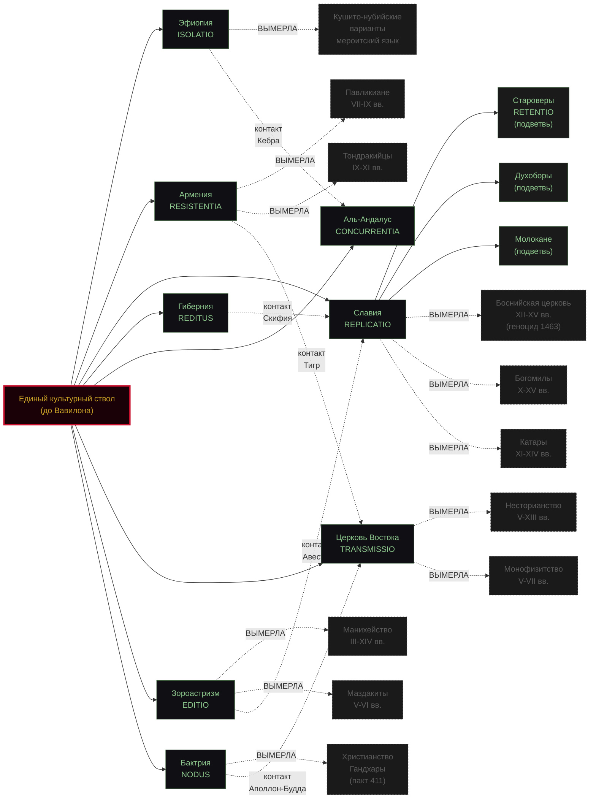

# ARCHIVUM HAERETICUM IMPERII HUMANITATIS
## Архив Империума Человечества

> *«Корпус един. Ветви враждуют. Архив помнит.»*

**CLASSIFICATIO: ◆ FIDELIS (архив) / ✚ CREDO (личная вера владельца)**
**EX ARCHIVO IMPERIALE — ORDO DIALOGUS**
Datum: 021.M3 · Sigillum: ANAFEMETRON · **ЕДИНЫЙ РЕПОЗИТОРИЙ: исследование + полные тексты + живой сайт**

> *Заявление владельца: этот архив затевался ради убеждения, что все религии и мифы человечества — ветви одного свода, разошедшегося от Вавилона. Это вера, не доказательство. Архив показывает структуру (см. `00/concordantia.md` — 20 скреп, ~188 совпадений), на которой эта вера может стоять. ✚ CREDO — это честность, не апологетика. Полное исповедание — в `00/CREDO.md`. Производные работы могут свободно игнорировать CREDO-печать.*

---

### QUID EST — ЧТО ЭТО

Три вещи в одном репозитории:

1. **ИССЛЕДОВАТЕЛЬСКИЙ АРХИВ** гипотезы единого корпуса: все религии и мифы человечества — ветви одного свода, разошедшиеся после Вавилона. Не проповедь — **классификация**: каждая запись несёт печать достоверности, опровергнутое не уничтожается, а печатается DAMNATUS.
2. **CORPUS DIVINUS** — полные тексты священных книг **целиком**, с проверенными открытыми переводами, в параллельных читалках: оригинал слева, переводы справа, выравнивание по стихам.
3. **ЖИВОЙ САЙТ** — весь свод в браузере: `petushokmaxorka-ai.github.io/archivum-haereticum/`

Цель — не библиотека. Цель — показать **швы единой книги**: где у ветвей одна страница, где искажение, где подделка.

### QUATTUOR SIGILLA — ЧЕТЫРЕ ПЕЧАТИ ДОСТОВЕРНОСТИ

| Печать | Кто ставит | Значение |
|---|---|---|
| ◆ **FIDELIS** | архив | Подтверждено источниками и академическим консенсусом |
| ◇ **SUSPECTUS** | архив | Рабочая гипотеза: не доказано, не опровергнуто, проверяемо |
| ✠ **DAMNATUS** | архив | Опровергнуто протоколом. Хранить как предостережение |
| **✚ CREDO** | **только владелец** | **Личное исповедание, не претензия на доказательство** |

**Важно:** ✚ CREDO — **не претендует на доказательство**, **не отменяет** архивные печати. Это транспарант веры владельца, открыто зафиксированный в `00/CREDO.md`. Подробно — `00/PROOEMIUM.md` §II.

### TABULA STRATEGIARUM — КАРТА СТРАТЕГИЙ ВЕТВЕЙ

**Стратегии** — это способы, которыми ветвь **сохраняет** корпус в условиях давления центростремительных сил (империи, реформации, гонения). 9 залов и их стратегий + подветви (живые и **ВЫМЕРШИЕ**) + **пересечения** (контакты). **ВЫМЕРШИЕ** — это ветви, которые исчезли (геноцид, репрессии, ассимиляция), но оставили след в архиве. **Логика дерева**: чем дольше существует ветвь, тем больше у неё подветвей и пересечений. **См. также**: `09-gentes/slavs/bosnia-ecclesia.md` (Боснийская церковь, вымершая в XV в.), `starovers-retentio.md` (Староверы, RETENTIO), `09-gentes/slavs/bogomili.md` (Богомилы, вымершие), `09-gentes/valachia-basarab.md` (крест. ссылки).

### TABULA DEPARTAMENTORUM — КАРТА АРХИВА

| Зал | Содержимое | Модуль Heretic OS |
|---|---|---|
| `00-manuscriptum-principale/` | PROOEMIUM, hypothesа, concordantia, CREDO | PRINCIPIUM |
| `01-eventus-babel/` | Вавилонский инцидент: башня, Втор 32, Смотрители | CODEX |
| `02-libri-deperditi/` | Утраченные книги: 1 Енох, 2 Енох, Юбилеи, Кебра, Голубиная, Метатрон-Идрис, Наг-Хаммади | LIBER |
| `03-rami-ecclesiae/` | Ветви церквей: 9 досье (Эфиопия → Ислам) | CODEX |
| `04-pantheones/` | Боги и культы ветвей: 62 досье | INQUISITIO |
| `05-probatio/` | PROBATA и DAMNATA с протоколами (Велесова книга и др.) | INQUISITIO |
| `06-quaestiones-apertae/` | Открытые вопросы и программа | FORGE |
| `07-scriptorium/` | Параллельные Писания: 24 экспоната | SCRIPTORIUM |
| `08-matrix-orthodoxa/` | Православная матрица: 9 досье + DAMNATA-NOSTRA | MATRIX |
| **`09-gentes/`** | **Народы и судьбы: 20 досье** | CHRONICLE |
| **`corpus/`** | **CORPUS DIVINUS: 6 корпусов (Коран, НЗ, ВЗ, 1 Енох, 2 Енох, Юбилеи)** | LIBER / NOOSPHERE |
| `data/` | JSON-ядра: corpus.json, timeline.json, pantheones.json | CHRONICLE / NOOSPHERE |
| `docs/` | Живой сайт (GitHub Pages) | MANUFACTORUM |
| `mcp/` | MCP-сервер архива (5 инструментов) | MACHINA |
| `INTEGRATIO.md` | Инструкция встройки в Heretic OS | MANUFACTORUM |
| `REPERTORIUM.md` | Полный реестр досье и корпуса | CATALOGUS |
| `REPERTORIUM-FUTURE-IDEAS.md` 🔮 | 30 идей для будущих досье/корпусов | — |
| `REPERTORIUM-MY-STACK.md` 🚀 | Инвентаризация 113+ досье и 5 корпусов | — |
| `REPERTORIUM-INSPIRATION.md` ✨ | ~250+ источников вдохновения | — |
| `GLOSSARY.md` | Терминология архива | — |
| `ARCHITECTURE.md` | Карта архива, куда класть, правила | — |
| `LICENSE` | CC BY-SA 4.0 | — |

### CORPUS DIVINUS — ЧТО УЖЕ В ТЕКСТАХ

| Корпус | Свидетели | Объём | Статус |
|---|---|---|---|
| Коран | Tanzil Uthmani + Крачковский | 6236 аятов | ✓ целиком |
| Новый Завет | SBLGNT + Синодальный | 7957 стихов | ✓ целиком |
| Ветхий Завет | WLC/OSHB + LXX Rahlfs + Синодальный | 23 213 стихов МТ ×3 свидетеля | ✓ целиком (39 книг) |
| 1 Енох | Геэз + Ахмим-греч. + Смирнов + Charles | 108 глав, 1058 стихов | ✓ целиком |
| 2 Енох | Славянская краткая ред. + Morfill | 68 глав + Мелхиседек | ✓ целиком |
| Юбилеи | Геэз + Смирнов 1895 + Charles 1917 | 50 глав, 1285 стихов | ✓ целиком |

Все переводы — открытые/PD (Крачковский, Синодальный 1876, Смирнов 1888/1895, Charles 1917, Morfill 1896, Tanzil); эфиопский слой — CC BY-NC-SA 4.0 с атрибуцией. Ничего проприетарного в корпус не входит.

### CONCORDANTIA — СКРЕПЫ СВОДА

Главный артефакт Архива — `00/concordantia.md` — **сводная таблица 20 ключевых сюжетов** (потоп, ось мира, падшие мудрецы, взятые живыми, писец богов, богиня-мать, громовержец, семёрка, скрытый праведник, ушедший бог, умирающий-воскресающий, жертва первенца, первый грех, священный текст как живой, конец света, землекоп, священный огонь, священный сосуд, покровитель путешественников, злой двойник) в **12+ параллельных ветвях** с академическими сносками.

Это **доказательная база** гипотезы единого корпуса. Без неё — гипотеза «давайте предположим». С ней — «смотрите, 188 совпадений, ~120 с прямыми текстовыми подтверждениями».

### CREDO — МАНИФЕСТ ВЛАДЕЛЬЦА

`00/CREDO.md` — **личное исповедание** владельца Архива. Владелец верит, что разошедшееся от Вавилона имело единый Божественный источник. Это **вера, не доказательство**. Не претендует на доказательство. Не отменяет архивных протоколов.

Другие имеют право на свой CREDO. Это пространство честного спора.

### ПРИНЦИП ЕДИНОГО РЕПОЗИТОРИЯ

Всё в одном: исследование (залы 00–09), полные тексты (`corpus/`), машинные данные (`data/`), сайт (`docs/`), доступ для агентов (`mcp/`), **лицензия открытого использования** (CC BY-SA 4.0). Репозиторий `corpus-divinus` слит сюда и упразднён.

### С ЧЕГО НАЧАТЬ

- **Хотите понять, что это?** → `00/PROOEMIUM.md` → `00/concordantia.md` (вердикт в §XXV)
- **Хотите добавить досье?** → `ARCHITECTURE.md` §VII
- **Хотите терминологию?** → `GLOSSARY.md`
- **Хотите полный реестр?** → `REPERTORIUM.md`
- **Хотите видеть, как работает протокол?** → `05-probatio/velesova-kniga.md` (полный DAMNATA-протокол)
- **Хотите увидеть самокритику Архива?** → `08-matrix-orthodoxa/DAMNATA-NOSTRA.md`

### 🔮 LISTS — ТРИ ВЕРХНЕУРОВНЕВЫХ СПИСКА

| Список | Эмодзи | Файл | Что внутри |
|---|---|---|---|
| **Future ideas** | 🔮 | [`REPERTORIUM-FUTURE-IDEAS.md`](REPERTORIUM-FUTURE-IDEAS.md) | **30 идей** в 6 категориях — только задумано, не реализовано |
| **My stack** | 🚀 | [`REPERTORIUM-MY-STACK.md`](REPERTORIUM-MY-STACK.md) | **113+ досье + 5 корпусов + 1 сайт** — инвентаризация сделанного |
| **Inspiration** | ✨ | [`REPERTORIUM-INSPIRATION.md`](REPERTORIUM-INSPIRATION.md) | **~250+ источников** — что питает Архив |

**Зеркало в GitHub** (см. скриншот `Lists`): Issue Templates в `.github/ISSUE_TEMPLATE/` + 6 GitHub Labels (авто-создаются через `.github/workflows/create-labels.yml`).

### 🆕 ПОСЛЕДНИЕ ДОБАВЛЕНИЯ (022.M3)

- ✨ **Славянский корпус (3 новых досье):**
  - `04-pantheones/slavic-paganism/rod-prabog.md` ✚ — **Род как Прабог** = Праджапати = Ахура-Мазда = Один = Бог-Отец (17 КБ)
  - `04-pantheones/slavic-paganism/mokosh-dea.md` ✚ — **Мокошь как Великая Мать** = Лайма = Хольда = Мойры = Парки; связь с Богородицей через «Покров» (18 КБ)
  - `00-manuscriptum-principale/concordantia-slavica.md` ✚ — **Славянская Конкорданция**: 5 текстов × 7 параллелей = 86% совпадений (15 КБ)
- 📊 **TABULA BRANCHES** — секция «карта ветвей» в каждом из 33 subfolder README (стратегия, состояние, контакты, подветви)
- 🔮 **3 списка** (Future ideas / My stack / Inspiration) как верхнеуровневая навигация
- 🏷️ **6 GitHub Labels** (✨ inspiration / 🚀 my-stack / 🔮 future-ideas, с эмодзи и без) — авто-создаются через GitHub Action

---
*Ex archivario quindecim milium annorum. Corpus est unum. Rami pugnant. Archivum meminit. Sigilla quattuor.*
